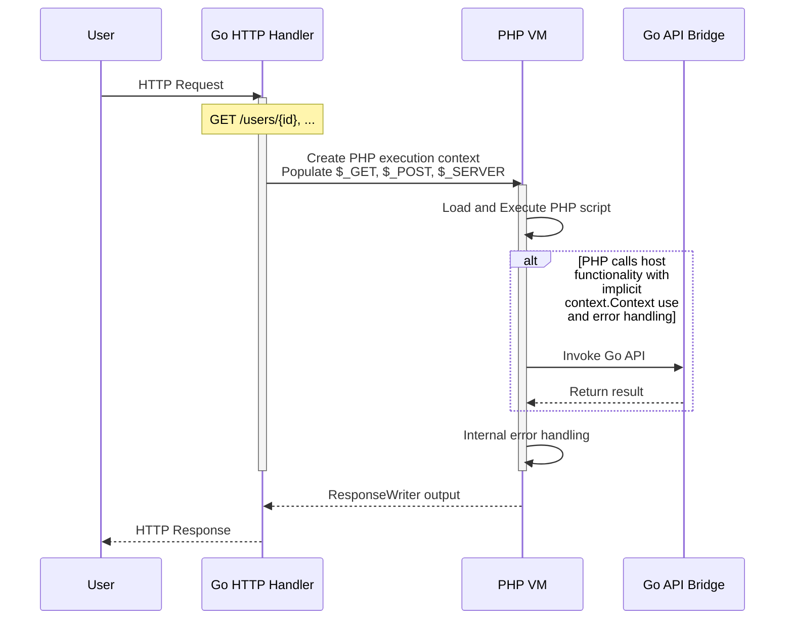
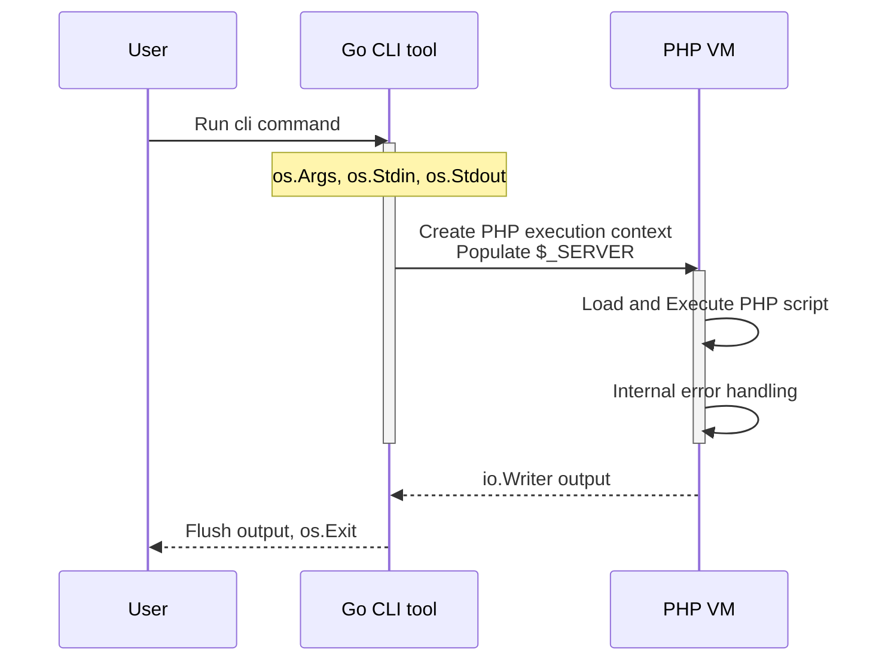

# About phpscript

The design of phpscript is to be a lightweight evaluator of php syntax.
A subset of the standard library is available, however the intent of the
runtime is mainly focused on:

1. Bundling and using PHP as part of a Go service, embedding php assets to a binary
2. Interfacing type safe Go code with PHP as an "intra-process" execution bridge

For the runner-compatible compile-once bytecode backend, see
[Flat-stack runtime](./flatstack.md).

This allows several use cases for the runtime, however does not support
running most open source PHP projects that are using advanced syntax
that the runtime doesn't implement.

## HTTP requests



The internal error handling (go runtime) can be also managed in the PHP
runtime with `try` and `catch` statements. Any error returned by any
function from the API bridge results in a PHP runtime exception.

Many APIs can be bound from Go side, giving you native execution.
Implicit context propagation and error handling makes storage or
repository packages usable without any go code changes required.

You can start a vanilla server with `phpscript server`, but the intent
is that you integrate the PHP VM in your Go application.

## CLI execution



PHP scripts can be run from the command line with
`phpscript <file.php>` or with using a shebang:

```php
#!/usr/bin/env phpscript
<?php

echo "Hello world\n";
```

The CLI can still bundle internal APIs for use in PHP, however you then
need to provide your own script binary that adds the bindings to be used
by the API bridge.

## Known divergences from PHP

Arithmetic follows PHP semantics (int/float coercion, overflow to float,
precision-14 float rendering), with the following exceptions:

- `/` and `%` by zero evaluate to `0` instead of throwing
  `DivisionByZeroError`. `intdiv()` does throw on a zero divisor;
  `fdiv()` returns `INF`/`-INF`/`NAN` as in PHP.

Memory reporting differs from PHP's allocator view:

- `memory_get_usage()` estimates the payload of live PHP values by walking
  every execution frame, so absolute numbers are far below PHP's (no zval or
  allocator overhead). Relative behavior matches: growth, `unset`, and frame
  release move the number the way PHP's does.
- `memory_get_peak_usage()` is sampled at walk points (usage calls and
  `memory_limit` checkpoints). An allocation both made and released between
  walks does not raise the peak, unlike PHP's allocator-level high-water mark.
- Exceeding `memory_limit` raises a catchable `RuntimeException`; PHP treats
  it as a fatal error that `catch` cannot intercept.

Namespaces:

- A file that declares a `namespace` may only declare classes and functions.
  PHP allows top-level statements there; phpscript rejects them at parse time.
  An included namespaced file is scanned for the symbols it declares rather
  than executed, which is what keeps resolving a name cheap, and a file with
  something to run cannot be treated that way. `use` and `declare` are
  preamble, not statements, so both are still allowed. Put executable code in a
  function, or in a file that declares no namespace.

Classes:

- `extends` and `implements` are parsed and recorded on the class, and confer
  nothing. A class gets no members from its parent: no inherited methods, no
  inherited properties or constants, no `parent::`, no constructor to fall back
  on, and `catch` cannot filter on a base class or an interface. Nothing checks
  that the parent or the interface exists, or that the class satisfies it.
  A class that relies on anything it did not declare itself will not run here,
  even though it parses and lints; declare the members it uses.
- `abstract`, `final` and `readonly` on a class are parsed and printed back,
  and none of them is enforced. An abstract class can be instantiated, a final
  one carries no restriction of its own, and a readonly class does not make its
  properties readonly.

Includes:

- `include` and `require` both abort the request when the file cannot be
  loaded; PHP `include` emits a warning and continues.
- Nested `class` declarations are a no-op (not registered), matching the
  interpreter hoist; PHP registers them when the statement runs.
