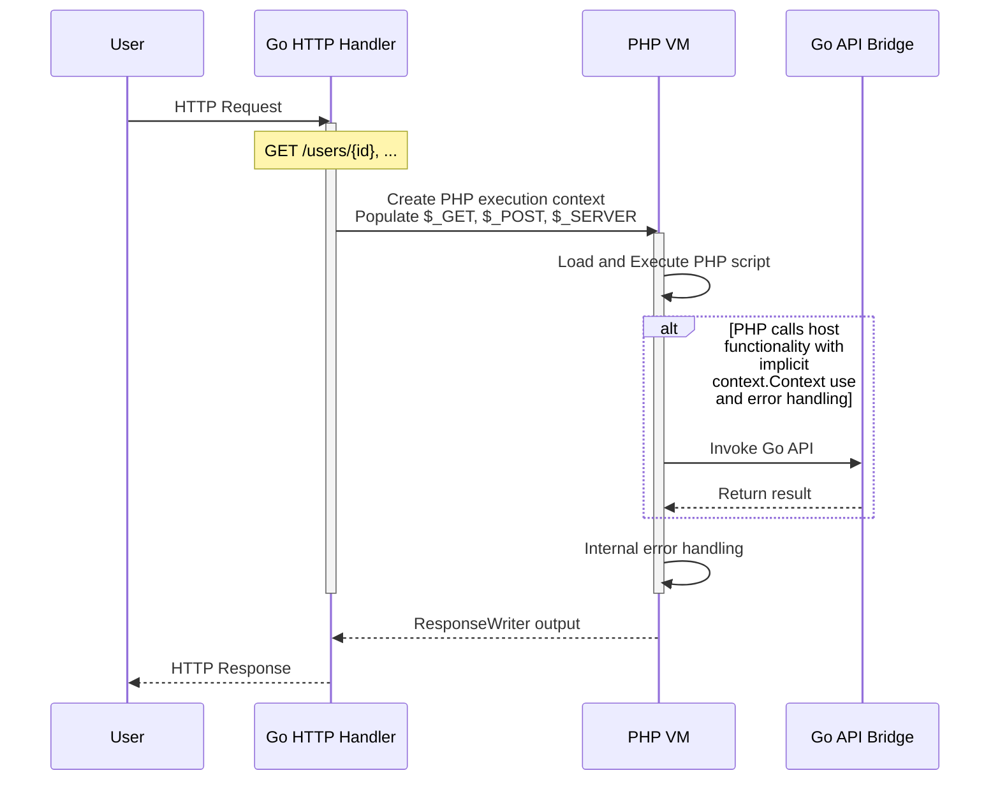
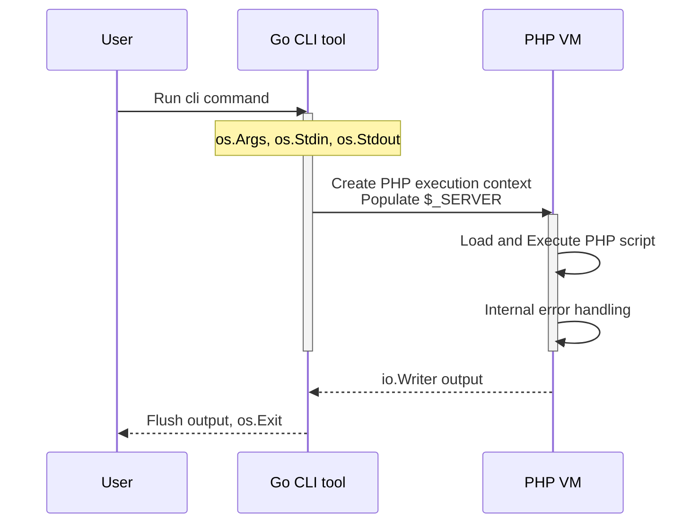

# About phpscript

The design of phpscript is to be a lightweight evaluator of php syntax.
A subset of the standard library is available, however the intent of the
runtime is mainly focused on:

1. Bundling and using PHP as part of a Go service, embedding php assets to a binary
2. Interfacing type safe Go code with PHP as an "intra-process" execution bridge

For the runner-compatible compile-once bytecode backend, see
[Flat-stack runtime](./flatstack.md).

This allows several use cases for the runtime, however does not support
running most open source PHP projects that are using advanced syntax
that the runtime doesn't implement.

## HTTP requests



The internal error handling (go runtime) can be also managed in the PHP
runtime with `try` and `catch` statements. Any error returned by any
function from the API bridge results in a PHP runtime exception.

Many APIs can be bound from Go side, giving you native execution.
Implicit context propagation and error handling makes storage or
repository packages usable without any go code changes required.

You can start a vanilla server with `phpscript server`, but the intent
is that you integrate the PHP VM in your Go application.

## CLI execution



PHP scripts can be run from the command line with
`phpscript <file.php>` or with using a shebang:

```php
#!/usr/bin/env phpscript
<?php

echo "Hello world\n";
```

The CLI can still bundle internal APIs for use in PHP, however you then
need to provide your own script binary that adds the bindings to be used
by the API bridge.

## Known divergences from PHP

Arithmetic follows PHP semantics (int/float coercion, overflow to float,
precision-14 float rendering), with the following exceptions:

- `/` and `%` by zero evaluate to `0` instead of throwing
  `DivisionByZeroError`. `intdiv()` does throw on a zero divisor;
  `fdiv()` returns `INF`/`-INF`/`NAN` as in PHP.

The bitwise operators `&`, `|`, `^`, `<<`, `>>` and `~` follow PHP's
precedence and semantics: operands are cast to int, `&`/`|`/`^` between two
strings work byte by byte and yield a string, shifts are int64 operations
where a count of 64 or more gives `0` (or `-1` for `>>` on a negative left
operand), and a negative shift count raises the same `ArithmeticError` PHP
raises. Two divergences:

- An operand PHP 8 refuses outright is cast rather than rejected. `~null` is
  `-1` and `~true` is `-2` where PHP raises `TypeError`, and an array operand
  of a binary bitwise operator counts as `0` rather than raising
  `TypeError: Unsupported operand types`.
- Casting a leading-numeric string (`"12abc" & 3`) does not emit PHP's
  "A non-numeric value encountered" warning. The value is the same.

Memory reporting differs from PHP's allocator view:

- `memory_get_usage()` estimates the payload of live PHP values by walking
  every execution frame, so absolute numbers are far below PHP's (no zval or
  allocator overhead). Relative behavior matches: growth, `unset`, and frame
  release move the number the way PHP's does.
- `memory_get_peak_usage()` is sampled at walk points (usage calls and
  `memory_limit` checkpoints). An allocation both made and released between
  walks does not raise the peak, unlike PHP's allocator-level high-water mark.
- Exceeding `memory_limit` raises a catchable `RuntimeException`; PHP treats
  it as a fatal error that `catch` cannot intercept.

Superglobals:

- `$_REQUEST` merges the route's path values over the query, form and cookie
  fields, so a `// @route GET /users/{id}` endpoint reads `$_REQUEST["id"]`.
  PHP's `$_REQUEST` carries no route parameters; carrying them under PHP's
  name was chosen over keeping `$_PATH`, a name PHP does not have. See
  [Predefined variables](reference/predefined-variables/README.md#_request).

Strings:

- A negative `$offset` past the start of the subject, a `substr_count()` window
  outside it, a `str_split()` length below 1 and an empty `str_pad()` pad string
  are clamped rather than raising the `ValueError` PHP 8 raises.
- `substr_replace()` does not accept array arguments.

Functions:

- Declaring a function twice, or declaring one over a name the runtime
  registers, raises a catchable `Exception`. PHP treats it as a compile-time
  fatal error no `catch` can reach, so a script that includes a file which
  redeclares can answer for it here and cannot there. `memory_limit` and an
  undefined constant diverge the same way. The first declaration stands and the
  program keeps running; `phpscript lint` reports the condition before the file
  is ever hoisted.
- The message is PHP's, word for word, except for the paths in it. PHP prints
  host paths (`/srv/app/lib/helpers.php`); a runtime whose scripts may be
  served out of an `fs.FS` has none to print, so both paths are the ones the
  script named, resolved against the root the shims are bound to, including
  every directory below it. `__FILE__` and `__DIR__` answer the same way and
  for the same reason.
- Only a declaration written at the top level of a file is honoured. A
  `function` inside an `if` body or another function is parsed and confers
  nothing, so `if (!function_exists('f')) { function f() {} }` leaves `f`
  undefined rather than declaring it. Nothing reports this yet.

Processes:

- `exec()`, `system()`, `passthru()` and `shell_exec()` run a command through
  `sh -c`, as PHP's do, and **leave the sandbox behind**. A process reads and
  writes with the permissions of the user running the server; `writable_paths`
  does not reach it, and neither does the source filesystem's root. A host that
  runs untrusted scripts leaves `stdlib/pexec` out. What the runtime does say is
  where a command starts: the working directory `chdir()` moved, resolved onto
  the host, so a relative path means the same thing to the command as to the
  script that ran it.
- `shell_exec()` answers `null` for a command that produced no output, as PHP
  does, which is also its answer for one that could not start. `exec()`'s
  `$output` is appended to rather than replaced, as PHP's is.
- The `proc_*` family is not implemented. It needs a process handle and pipe
  resources `fopen()` can work with, which is a kind of value the runtime does
  not have.

Filesystem:

- `glob()` searches the source filesystem, so `glob("/etc/host*")` lists
  `etc/host*` inside the root rather than the host's `/etc`, and a pattern that
  climbs stops at the root. Matches come back in the shape the pattern was
  written in, as PHP's do. `glob()` takes no `$flags` argument, so `GLOB_BRACE`
  and the rest are not defined. See the path rules under Includes.
- `opendir()` takes no `$context` argument, there being no stream contexts to
  pass it, and the handle it returns carries the listing rather than an open
  directory: a source filesystem an embedded application ships has no
  descriptor to hold. `readdir()` and `closedir()` require that handle. PHP
  falls back to the last directory `opendir()` opened, which needs a global the
  runtime does not keep. Names come back sorted, with `"."` and `".."` first, as
  `scandir()` answers; PHP's `readdir()` answers in the directory's own order,
  so a script that depends on an order sorts either way. Reading a handle after
  `closedir()` reports the end of the listing, where PHP throws.

Arrays:

- `array_shift()`, `array_unshift()`, `array_pop()`, `array_push()` and
  `array_splice()` require a script array. They resize their argument, and a
  Go slice cannot grow through the interface value holding it, so a value a
  binding returned as a native slice (`explode()`, `array_keys()`) is an error
  rather than a mutation the script cannot observe. Assign it to a variable
  built by the script first: `$parts = array_merge(explode(",", $s));`.

JSON:

- `json_encode()` writes a forward slash as itself. PHP escapes it, so
  `["path" => "a/b"]` is `{"path":"a\/b"}` there and `{"path":"a/b"}` here.
  Both are the same document to a parser; a byte comparison or a signature
  over the encoded text is not. PHP produces this form with
  `JSON_UNESCAPED_SLASHES`, which is not defined here: the encoding takes no
  flags, see [design.md](design.md#json). `json_encode()` accepts a literal
  second argument and ignores it; a `JSON_*` name raises `Error`, since no
  constant defines it, and `phpscript lint` reports it first.

Constants:

- An undefined constant throws, as it does in PHP 8, and the class differs:
  `RuntimeException` here, `Error` there. An `Error` in PHP is a fault a caller
  is not expected to handle, and a name this runtime does not define is a
  condition a script can answer for, so `catch (Exception $e)` takes it and
  `catch (Error $e)` does not. `memory_limit` diverges the same way.
- An unset *variable* of the same spelling stays null and keeps running, which
  is PHP's behaviour and the reason the two are separate lookups. `global` is
  the exception: it is a reserved word, the statement is a documented no-op,
  and the bare keyword answers null rather than throwing.

Namespaces:

- A file that declares a `namespace` may only declare classes and functions.
  PHP allows top-level statements there; phpscript rejects them at parse time.
  An included namespaced file is scanned for the symbols it declares rather
  than executed, which is what keeps resolving a name cheap, and a file with
  something to run cannot be treated that way. `use` and `declare` are
  preamble, not statements, so both are still allowed. Put executable code in a
  function, or in a file that declares no namespace.

Classes:

- `extends` on a class confers nothing. A class gets no members from its parent:
  no inherited methods, no inherited properties or constants, no `parent::`, and
  no constructor to fall back on. A catch clause and `instanceof` do not follow
  it, and nothing checks that the parent exists. A class that calls something it
  did not declare fails at the call, even though it parses and lints; declare
  the members it uses. This is a decision rather than a gap; see
  [Design decisions](design.md).
- `implements` is checked and confers nothing: a class must declare every method
  its interfaces name, or `phpscript lint` reports it and the runtime raises a
  `RuntimeException`. An interface contributes no body, no property and no
  constant. A name no `interface` declaration in the same file defines is not a
  contract and is not checked, so `implements Countable` loads: phpscript
  declares none of PHP's built-in interfaces.
- `instanceof` compares the class name, and an interface name against the list
  the class declared, so `$a instanceof SomeInterface` is true for a class that
  implements it. Nothing follows `extends` on a class.
- `abstract`, `final` and `readonly` on a class are parsed and printed back,
  and none of them is enforced. An abstract class can be instantiated, a final
  one carries no restriction of its own, and a readonly class does not make its
  properties readonly.
- An anonymous class is named by the parser, so `get_class()` answers
  `class@anonymous$1` where PHP answers a name built from the file and line that
  declared it. Neither spelling is one a script should compare against. The
  bytecode engine does not compile an anonymous class, so a program containing
  one runs on the interpreter; see [Flat stack](flatstack.md).
- `phpscript fmt` refuses a file containing an anonymous class rather than
  rewriting it, because the printer would emit the synthesized name in place of
  the declaration. The file is left untouched.

Objects:

- `foreach` over an object yields every property. PHP yields only the ones
  visible where the loop is written; phpscript enforces no visibility anywhere,
  so there is nothing for it to filter on. `(array)` and `get_object_vars()`
  read every property for the same reason.
- `(array)` on an object uses the plain property name. PHP prefixes a private
  name with the declaring class and a protected one with `*`, both wrapped in
  NUL bytes; a key holding a NUL byte is one no script could index.
- `(object)` shares rather than copies. PHP copies the array it converts,
  because arrays are values there; here they are handles, and the cast is not
  the place to make one exception to that. See
  [Value semantics](reference/types/value-semantics.md).
- `==` between two objects compares more than the properties: the variable each
  was first assigned to, and the order the properties were added in. Two
  separately built objects with equal properties are therefore unequal where PHP
  says they are equal, if they were assigned to differently named variables or
  built in a different order. `===` is identity, as in PHP.

Includes:

- `include` and `require` both abort the request when the file cannot be
  loaded; PHP `include` emits a warning and continues.
- Nested `class` declarations are a no-op (not registered), matching the
  interpreter hoist; PHP registers them when the statement runs.
- A relative path resolves against the working directory only. PHP tries the
  working directory, then `include_path`, then the directory of the file doing
  the including; the last of those is what makes `include "b.php"` from
  `a/x.php` find `a/b.php` there and nothing here. `set_include_path()` is the
  SPL autoloader's path and takes no part in `include`.

Paths and the working directory:

- The source filesystem is mounted at `/`. `__FILE__` is `/public/index.php`
  where PHP would say `/srv/site/public/index.php`, `__DIR__` is `/public`, and
  `getcwd()` answers `/` or `/app`. There is no spelling that reaches the host
  filesystem: a runtime whose scripts are served out of an embedded tree has no
  host path to name, so `/` is the root of what the script can address and a
  path that would climb above it stops there. `file_get_contents("/etc/passwd")`
  reads `etc/passwd` inside the root, or nothing.
- A path written from `/` ignores the working directory, which is PHP's rule
  for an absolute path. That is what makes `include __DIR__ . "/x.php"` name one
  file wherever `chdir()` has been, and it is why the constants are written that
  way.
- `chdir()` moves this request's working directory and nothing else. It is
  per-runtime state, and a host builds one runtime per request, so a script
  cannot move another request's; the process working directory is never touched.
  A directory that does not exist is refused with `false`, as in PHP, without
  the warning PHP also emits.
- The one exception to all of it is an uploaded file. The runtime writes it
  outside the root by design and hands the script the `tmp_name` it wrote, so
  reading that path back reads a file the runtime itself produced. A path the
  request's upload registry did not issue is not one, which is the check
  `is_uploaded_file()` answers with.
