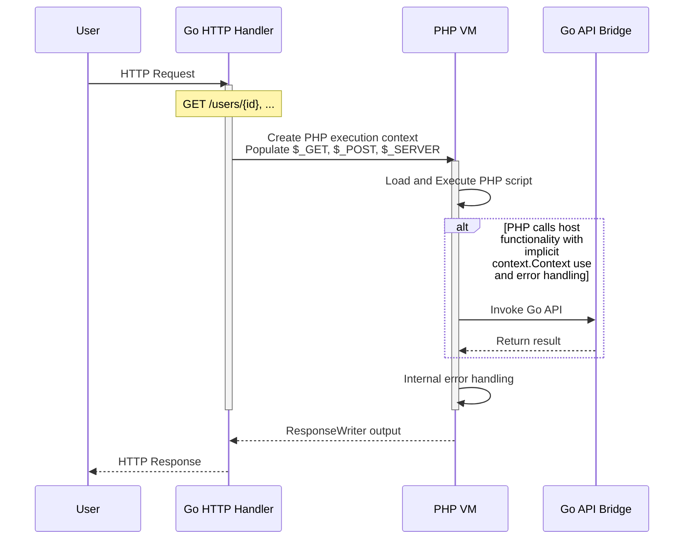
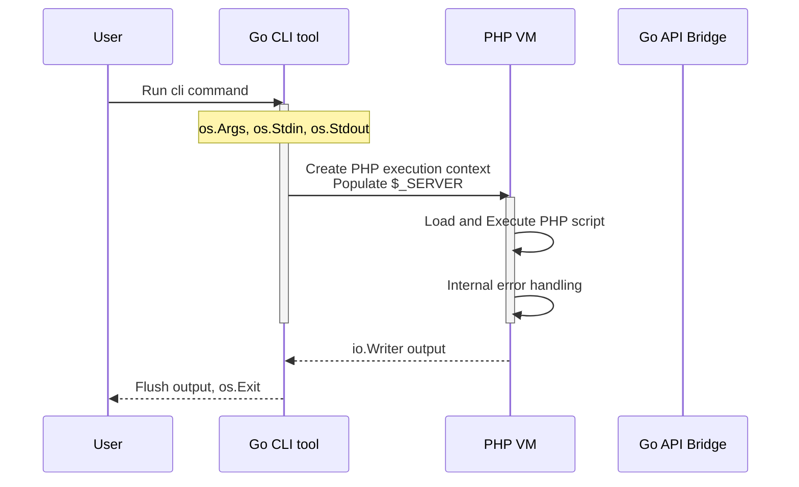

# About phpscript

The design of phpscript is to be a lightweight evaluator of php syntax.
A subset of the standard library is available, however the intent of the
runtime is mainly focused on:

1. Bundling and using PHP as part of a Go service, embedding php assets to a binary
2. Interfacing type safe Go code with PHP as an "intra-process" execution bridge

This allows several use cases for the runtime, however does not support
running most open source PHP projects that are using advanced syntax
that the runtime doesn't implement.

## HTTP requests

The internal error handling (go runtime) can be also managed in the PHP
runtime with `try` and `catch` statements. Any error returned by any
function from the API bridge results in a PHP runtime exception.

Many APIs can be bound from Go side, giving you native execution.
Implicit context propagation and error handling makes storage or
repository packages usable without any go code changes required.

You can start a vanilla server with `phpscript server`, but the intent
is that you integrate the PHP VM in your Go application.

## CLI execution

The excution of PHP scripts via the command line can be done with
`phpscript run <file.php>` or with using a shebang and an executable
file `#!/usr/bin/env phpscript` followed by the script code.

The CLI can still bundle internal APIs for use in PHP, however you then
need to provide your own script binary that adds the bindings to be used
by the API bridge.
